# 100DaysOfCodeFrontend

## Intro

Hi. Here I am and my dive into frontend development. I hope to finish this story on day 100. Best regards everyone, Wo1fgarr.  
I have an approximate curriculum based on [Nick Scully's curriculum](https://levelup.gitconnected.com/a-100daysofcode-timeboxed-front-end-development-curriculum-cb4b6c2081c2), which will probably change a lot in the process.

---

## HTML

| Days | Description | Done | Tomatoes |
| --- | --- | --- | --- |
| 1 | HTML page structure  | &#9745; | 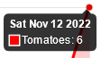 |
| 2 | Practice: Revise the materials of Day 1 - HTML page structure with small part of CSS HTML elements Nesting HTML elements | &#9745; | 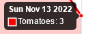 |
| 3 | Semantic markup Links / multiple pages | &#9745; | 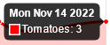 |
| 4 | Images Tables Practice: Semantic Layout and Multipage site| &#9745; | 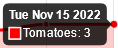 |
| 5 | img: loading, decoding attributes Audio/video media | &#9745; | 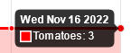  |
| 6 | Forms and form elements | &#9745; | 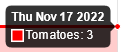 |
| 7 | Create markdown table(for GitHub readme.md in repository) Try to use PUG.js | &#9745; | 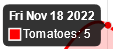 |
| 8 | More PUG practice  | &#9745; | 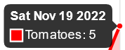 |
| 9 | And at this point, based on what I studied above, I will create my own website Check result in W3C validator  | &#9745; | 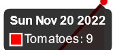 |

---

## CSS

| Days | Description | Done | Tomatoes |
| --- | --- | --- | --- |
| 10 | Basic CSS, inherit selector, non-inherit selector Training in the online editor | &#9745; | 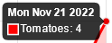 |
| 11 | Basic CSS - refinement of the site from a block of HTML Now this site is Multipage Started to learn block layout, fonts and background images | &#9745; | 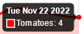 |
| 12 | Basic CSS Hello flexbox, I choose you (I know that this is clearly not basic CSS, but this technology seemed to me the best for the layout of the site right now) Hi Emmet |  &#9745; | 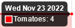 |
| 13 | Practice in the online editor with base selectors, pseudo-classes Diving into advanced selectors that can search for elements by substring in attributes Selectors for styling form elements | &#9745; | 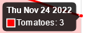 |
| 14 | Selectors and pseudo-classes: :first-child, :last-child, :nth-child :hover, :not, ::after, :checked| &#9745; | 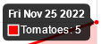 |
| 15 | Selectors and pseudo-classes: :first-of-type, Subsequent Item Selector, :empty ::first-line, ::first-letter, [foo^="bar"], [foo$="bar"] | &#9745; | 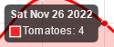 |
| 16 | Selectors and pseudo-classes: [foo*="bar"], [foo~="bar"], [foo\|="bar"] :enabled, :disabled | &#9745; | 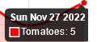 |
| 17 | I'm starting to dive into float, flexbox, and grid. | &#9745; | 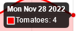 |
| 18 | Grid layout | &#9745; | 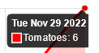 |
| 19 - 26 | working with layout with Figma and Pixel Perfect | &#9745; | 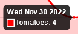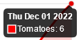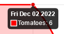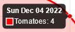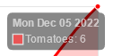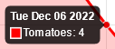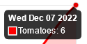 |

---

## JavaScript

| Days | Description | Done | Tomatoes |
| --- | --- | --- | --- |
| 27 | Basic JavaScript. Introduction to JavaScript | &#9745; | 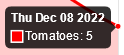 |
| 28 | Basic JavaScript. Javascript Variables: Variable Declarations, Hoisting, Naming Rules, Scopes Datatypes: number | &#9745; | 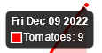 |
| 29 | Basic JavaScript. Datatypes: string, string methods | &#9745; | 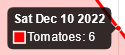 |
| 30 | Basic JavaScript. Datatypes: boolean, bigint, null, undefined, symbol Basic JavaScript. Datatypes: objects, built-in objects typeof operator Type casting: Type conversion vs. type coersion, explicit type casting, implicit type casting | &#9745; | 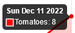 |
| 31 | Basic JavaScript. Indexed collections | &#9745; | 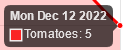 |
| 32 | Basic JavaScript. Control Flow: while statement, Conditional statements(If else, Switch Case) Functions: Function Parameters, Arrow Functions, Default Parameters | &#9745; | 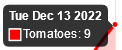 |
| 32 | I started writing a simple calculator  | &#9745; | 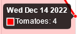 |